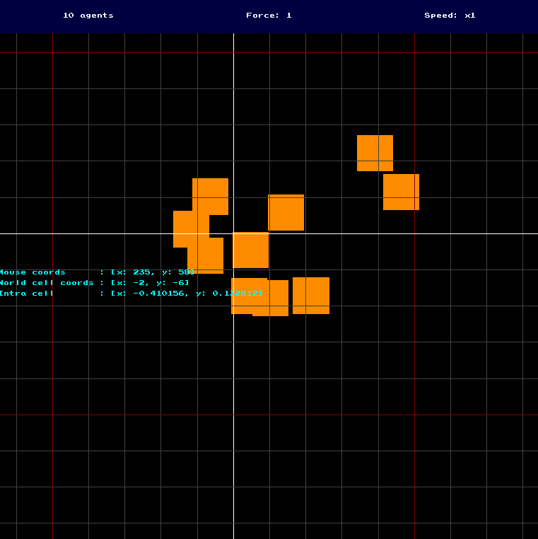

# Agents project

Implementation of a multi-agent simulation along with an application allowing to visualize the evolution of the system. The project provides a basis with simple behaviors and handling of the external processes needed to execute the simulation. The goal being that the user can then easily extend it and add its own behavior to model a certain behavior.

# Installation

- Clone the repo: `git clone git@github.com:Knoblauchpilze/agents.git`.
- Clone dependencies:
    * [core_utils](https://github.com/Knoblauchpilze/core_utils)
    * [maths_utils](https://github.com/Knoblauchpilze/maths_utils)
- Go to the project's directory `cd ~/path/to/the/repo`.
- Compile: `make run`.

Don't forget to add `/usr/local/lib` to your `LD_LIBRARY_PATH` to be able to load shared libraries at runtime. This is handled automatically when using the `make run` target (which internally uses the [run.sh](data/run.sh) script).

# General principle

A multi-agents system is a system where simple agents have a limited knowledge about their environment and are allowed to take decisions to act in the world accordingly.

The concept is to isolate as much as possible the agent so that it does not have any more control on the world as desired by the user.

We use a mechanism where agents can only see the world through perceptions and send influences to change it. Whether or not the perceptions are accurate or if the influences are coming through is not under the control of the agent.

This mechanism is quite powerful in the sense that it allows to design agnostic behaviors which only rely on a pure abstraction of how thinking work. The locality of the decisions are also interesting as there's no top-level AI that make the agents move and yet we can still see some collective intelligence emerge.

# The environment

The system is structured around a base building block which is called the [environment](src/game/environment/Environment.hh). This provides the framework to execute the agents and apply the result of their thinking process.

## Entity-component system

### Genesis

There are numerous ways to describe the hierarchy of elements represented in the environment. In the past we relied on an inheritance system where we would start from a base `EnvironmentalObject` class which would then be specialized multiple times like so:

```cpp
class EnvironmentalObject {
  private:
    utils::Vector2f m_position;
};

class MovingObject: public EnvironmentalObject {
  private:
    utils::Vector2f m_speed;
};

class AgentBody: public EnvironmentalObject {
  private:
    Frustum m_frustum;
}
```

This led to a rather deep class structure where the more up the hierarchy a component was the more abstract it was and the harder it was to modify its behavior.

In a nutshell, [this](https://cowboyprogramming.com/2007/01/05/evolve-your-heirachy/) article explains very well what was going on.

### What do to about it ?

In order to make it more viable, we decided to use this time an [Entity-Component system](https://en.wikipedia.org/wiki/Entity_component_system). This kind of system is used by Unity for example and revolves around having a lightweight `Entity` class which can then be associated various behaviors or `Component` which provide a specific aspect to it.

A single component is an atomic piece of behavior which handles for example moving an object around, or the laying out of pheromons, or anything else.

It is much easier to extend such a system because as components are designed to be independent, we don't have any side effect when adding something to its processing: as other components don't have access to any of the property managed by another component it can't have ripple effects.

### Implementation

There are also countless ways to implement a entity component system. It seems like a popular library is the [entt](https://github.com/skypjack/entt) library, which is very efficient.

We decided to go for an in-house implementation (of course) which is most likely much simpler and less thought-through.

The system is based on the [Entity](src/game/environment/Entity.hh) class which provides a smart container for a set of components with common operations:

```cpp
class Entity: public utils::CoreObject {
  public:

    Entity();

    void
    add(ComponentShPtr comp);

    void
    erase(ComponentShPtr comp);

    void
    update();

    iterator
    begin() const noexcept;

    iterator
    end() const noexcept;

    /* ... */

  private:

    /* ... */
};
```

The entity is attached an identifier and the user can iterate on the components attached to it. An `update` method also allows to keep the components up-to-date with each other and is scheduled by the environment once per frame.

A component is an interface which can be refined to add more capabilities to the entities of the world:

```cpp
enum class Type {
  MovingObject,
  Agent,
  Animat,
  Renderer,
  UserData,
};

class Component: public utils::CoreObject {
  public:

    const Type&
    type() const noexcept;

    bool
    markedForDeletion() const noexcept;

    template <typename T>
    const T*
    as() const noexcept;

    template <typename T>
    T*
    as() noexcept;

    /**
     * @brief - Perform the update of the component so that it is up
     *          to date with the underlying data that it might be
     *          using.
     *          This method should be implemented by inheriting classes
     *          so that a specific behavior is provided.
     */
    virtual void
    update() = 0;

    void
    attach(const Entity& ent) noexcept;

  protected:

    Component(const Type& type);

  private:

    Type m_type;
    bool m_toBeDeleted;
};
```

Each component has a type which can be used by the environment to determine if a specific entity should be considered for a certain process (say rendering, or update of forces, etc.). In case a new component should be added the user can register the corresponding type and implement the class.

Each component also defines a boolean indicating whether it should be deleted or not. This can be the case when an entity loses a certain capacity in which case the component can be removed. By default all components are not marked to be deleted.

The environment performs a check at each frame to remove the components from entities when they are to be deleted, and then proceeds to delete the entities that don't have any component anymore.

## Objects in the world

Using the entity component system, objects in the world are merely a collection of components. The environment doesn't have to know the exact components registered for each entity and only apply processes to the ones that present the right facet.

## Processing

The environment is executed through a [Launcher](src/game/environment/Launcher.hh) class which allows to process asynchronously the operations needed to render the components and entities.

Every frame, the environment is communicated a certain amount of time that passed through a helper class which manages time and can proceed to update the components like so:

```cpp
void
  Environment::simulate(const time::Manager& manager) {
  computePreAgentsStep(manager);
  computeAgentsStep(manager);
  computePostAgentsStep(manager);
}
```

The `pre-agents step` involves making everything ready so that the agents can be correctly executed.

Then comes the execution of the agents in and of itself.

And finally the `post-agents step` where only the result of the execution of the agents are applied to the environment.

## Agents

An agent is a special kind of `Component` which can be attached to an entity and allows it to think and interact in the world.

### What is an agent

Each agent does not work alone and needs a handful of other companion components to allow its execution in a correct way.

First, an agent needs a vehicle to move through the world and perceive things. This object might or might not be visible but it is required to represent it in the world.

Second, the agent needs a way to be communicated what the body perceives and then influence the world around him. We provide another kind of component for this purpose, called an `Animat`. The animat makes the connection between the physical part of the agent (its body) and its brain (the `Agent`) class.

### Animats

An animat is responsible for providing a frustum (which is basically the view persepctive of the agent). It also receives the perceptions (i.e. what is perceived through the frustum) and collect the influences that the agent might emit during its thinking process.

### Agent

The agent class is meant as the brain part of any element that has a collection of more or less complex behaviors in the environment. This class is structured around two main methods

```cpp
class Agent: public Component {
  public:

    /**
     * @brief - Create a new agent with the specified animat.
     * @param animat - a reference to the animat attached to the
     *                 agent. It is the way the agent has to be
     *                 in touch with the world and influence it.
     * @param bUpdate - the callback to define when the behavior
     *                  of the agent should be updated.
     * @param bSelection - the callback to pick a new behavior.
     * @param bTermination - the callback to handle the behavior
     *                       once it is completed.
     */
    Agent(Animat& animat,
          brain::BehaviorUpdate bUpdate,
          brain::BehaviorSelection bSelection,
          brain::BehaviorTermination bTermination);

    /**
     * @brief - Implementation of the interface method to handle
     *          the update of this component with the underlying
     *          data.
     */
    void
    update() override;

    /**
     * @brief - Evaluate the decisions to take for this agent.
     *          This uses the data propagated in the body of
     *          the agent (which is its representation in the
     *          world) and output influences.
     * @param manager - information about the time at the moment
     *                  of the execution of this method.
     * @param rng - a device to produce random number generator.
     */
    void
    live(const time::Manager& manager,
          utils::RNG& rng);
};
```

The interface can be customized by providing callbacks to use to determine whether a new behavior should be defined, what to do with a completed one and how to pick a new behavior.

The `live` method is called during the agents step at each frame of the environment.

It is usually not necessary to specialize this class as the behavior is meant to be changed through the callbacks to provide to the constructor. The agent can have more than one active behavior at any time and each completed behavior is then recycled or kept depending on the callback's result.

### Perceptions

An important subsystem of the simulation is the concept of perceptions. A perception is what any agent can use to perceive the world around it. A perception is composed of two main facets:
* a moving object interface, allowing to perceive the agent in the world. We consider that if an entity does not have a moving object as a component, it is invisible and thus cannot be perceived by other agents.
* a user data segment, which can hold anything the user decides to put in the object.

This translates in the code in this form:
```cpp
class Perception {
  public:

    Perception(const MovingObject& object, const UserData* data = nullptr);

    /// @brief - The bounding box of the moving object facet.
    const utils::Boxf&
    bbox() const noexcept;

    /// @brief - Whether or not some user data is available.
    bool
    hasUserData() const noexcept;

    /// @brief - Fetch the user data as a certain type.
    template <typename T>
    const T*
    as() const noexcept;
};
```

The environment populates the perceptions for each agent by scanning for other entites that have a `MovingObject` component attached to them and then fetching the user-data that might be attached to the entity as well. The content is then bundled into a `Perception` object which is provided to the agents.

### Behavior

A behavior is a specialized process that allows to update the position and internal state of an agent. It can be anything and can have various degrees of complexity. It is structured around two different methods.

```cpp
class Behavior: public utils::CoreObject {
  public:

    virtual bool
    completed() const noexcept = 0;

    virtual
    std::vector<InfluenceShPtr>
    perform(const AgentData& data,
            const Perceptions& perceptions,
            const time::Manager& manager) = 0;
};
```

The `completed` method allows for the agent to determine whether this behavior is completed (meaning that it performs its duty). When it is the case, the agent will trigger a callback to pick a new one.

The `perform` method is called as long as the behavior is not completed and allows to produce influences which can be used to change properties of the agent and its state in the world.

The behavior is provided with the perceptions at the time of the call (which provides the most up-to-date representation of the surroundings of the agent) and a collection of data representing the current state of the body of the agent. This can be used to adapt the processing based on certain internal properties (think of searching for food in case the agent is hungry or so).

### Influences

Influence are the main way agents can interact and change their world. The influences are produced by the behaviors and are then processed by the environment to try to apply them as best as possible.

An influence can have a variety of impacts: it can change the position of an object, decrease the amount of a certain substance, etc. However, it is always the result of the application of a change on some object from another object.

In order to make the whole concept rather flexible for the user, we chose to have the following interface for an influence:

```cpp
/// @brief - A convenience define representing a callback for
/// the application of an influence on the receiver.
using ReceiverCallback = std::function<void(MovingObject&)>;

/// @brief - A convenience define representing a callback for
/// the application of an influence on the emitter.
using EmitterCallback = std::function<void(Agent&)>;

/// @brief - A convenience define representing a callback for
/// the application of an influence on the environment.
using EnvironmentCallback = std::function<void(Environment&)>;

class Influence {
  public:

    Influence(EmitterCallback eCB,
              ReceiverCallback rCB,
              EnvironmentCallback envCB = influence::noOpEnvironment());

    void
    setEmitter(Agent* obj);

    void
    setReceiver(MovingObject* obj);

    void
    apply(Environment& env) const {
      // Apply callbacks.
      m_rCallback(*m_receiver);
      m_eCallback(*m_emitter);

      m_envCallback(env);
    }
};
```

The idea is that the influence has two callbacks that act on the emitter and receiver and trigger some process on them. We also define convenience generators which perform the creation of an empty callback that has no impact on the emitter or receiver. In addition, a third callback is available to interact on the environment.

Typically one can generate a linear motion influence like so:
```cpp
utils::Vector2f i(1.0f, 0.0f);
InfluenceShPtr inf = std::make_shared<Influence>(
  influence::noOpEmitter(),
  [i](MovingObject& obj) {
    obj.applyForce(i);
  },
  influence::noOpEnvironment()
);
```

This will create an influence which apply a force along the `x` axis to the moving object receiving it. It is theoretically possible to extend this behavior to applying any effect on the receiver.

Another possibility is to use the environment callback to spawn new objects or agents into the world like so:
```cpp
utils::Vector2f i(1.0f, 0.0f);
InfluenceShPtr inf = std::make_shared<Influence>(
  influence::noOpEmitter(),
  influence::noOpReceiver(),
  [](Environment& env) {
    utils::Uuid e = env.createEntity();

    env.registerComponent(e, /** FIXME: Create component. **/);
  }
);
```

By combining the three callbacks it is possible to create complex influences which will modify the emitter and receiver but also the environment. It is of course not mandatory to have all three callbacks active for a single influence.

## Launching the simulation

The environment defines a framework to execute the processing of agents but doesn't really allow to simulate their executions. This can be accomplished through a dedicated class: the [Launcher](src/game/environment/Launcher.hh).

The `Launcher` defines method to start, pause, resume or stop the simulation. The simulation in and of itself is managed in a dedicated thread which allows to smoothly perform it while not preventing the other processes of the application (typically a rendering routine) to work.

It is possible for the user to specify how many frame per second the `Launcher` should try to maintain, and how much time elapses in the simulation for each call to the `simulate` method:

```cpp
void
Launcher::simulate(bool sleep, float desiredFPS) {
  // Update the time manager by one increment.
  m_time.increment(m_step, m_stepUnit);

  // Simulate the current step.
  utils::TimeStamp s = utils::now();
  m_env->simulate(m_time);
  utils::Duration d = utils::now() - s;

  utils::Duration expected = utils::toMilliseconds(1000.0f / desiredFPS);
  if (d > expected) {
    warn("Took " + utils::durationToString(d) + "ms to compute frame, expected " + utils::durationToString(expected) + "ms");
    return;
  }

  // Wait for a bit if needed.
  utils::Duration remaining = expected - d;
  if (sleep && remaining > utils::toMilliseconds(MINIMUM_SLEEP_TIME)) {
    std::this_thread::sleep_for(remaining);
  }
}
```

The process is always the same: the `Manager` handling the time is incremented, and the environment is requested to step the simulation one step forward with the manager as information. When the scheduling is done the simulation thread will sleep for the remaning frame duration (which can be quite long) so as not to overload the CPU.

The `Manager` allows to completely decouple the time passing in the simulation from the hardware onto which the environment is executed: we can control very precisely the speed at which the simulation runs and possibly speed up time or slow it down as needed.

## Specialize the simulation

The application provides a simple framework where no real agent or behavior exists. It is intended as a base for exploring the capabilities or the model of certain agents in a dedicated process.

### Create new components

In order to allow agents to modify and interact with their environment, it might be needed to create new types of components.

As described in the [implementation](###implementation) section, a component is just a wrapper which define a type and a set of properties. By default the simulation defines the following kinds:
```cpp
enum class Type {
  MovingObject,
  Agent,
  Animat,
  Renderer,
  UserData,
};

std::string
typeToString(const Type& t) noexcept;
```

Each type correspond to a facet of the behavior of an entity and is simulated and accessed in a different way by the environment. For example the `MovingObject` facet mainly defines how the object is perceived by other elements and how it can move in the environment whereas the `Renderer` facet is used by the application to display the component on screen.

Whenever the user needs to refine the simulation and generate new components, it is needed to register a new value in the enumeration, and add the corresponding case in the `typeToString` method (in order to obtain a human readable descrption of the component type).

It is possible to then register the component to the entities that are created when initializing the simulation (see the [following](###initialization-of-the-simulation) section) or when spawning new agents.

Note that by default the environment only consider the `MovingObject` component as valid elements for perceptions: if the new component kind should be perceivable, it might be required to update this behavior. See the [perception](###create-new-perceptions) section for more details.

Finally, note that most of the component created by the user are encouraged to use the `UserData` type: the environment will associate the component with this type to the perceptions provided to the other agents. Note that we actually only handle a single component with the type `UserData`. Note as well that the agents will be given access to the components through the perceptions: this could mean that the agents could call the `simulate` method or any other public member of the interface of the component. We of course **STRONGLY ADVISE AGAINST THAT**.

### Initialization of the simulation

Before starting a new simulation it is important to initialize the environment with relevant data and schedule the execution of the living processes.

This can be done using the [initialization](src/game/simulation/Initialization.cc) template provided in the application. This file define two methods:
* `createLauncher` allows to define the properties to execute the simulation by returning a `Launcher` object used to control the simulation.
* `initialize` defines a way to create objects in the simulation before it starts.

Both these methods are called before starting the execution and the application is made visible to the user. This guarantees that any simulation has the opportunity to prepare everything before starting the processing.

The `createLauncher` method is structured like this in the default example:
```cpp
Launcher
createLauncher(Environment& env) noexcept {
  return Launcher(
    &env,
    /** FIXME: Define desired FPS **/,
    1000.0f / /** FIXME: Use desired FPS **/,
    mas::time::Unit::Millisecond
  );
}
```
It is up to the user to define time parameters consistent with what is expected and required for the simulation at hand. The `createLauncher` method will be used by the application to schedule the environment's execution.

The `initialize` method is structure like so:
```cpp
void
initialize(Environment& env) noexcept {
  // Create the spawner function.
  utils::Boxf area(0.0f, 0.0f, 10.0f, 5.0f);

  auto spawner = [area](utils::RNG& rng) {
    /** FIXME: Handle spawning code **/
  };

  // Create the entity factory function.
  auto factory = [](const utils::Uuid& uuid, const utils::Point2f& p, utils::RNG& /*rng*/, Environment& env) {
    RigidBody rb = /** FIXME: Create a rigid body **/;

    ComponentShPtr mo = std::make_shared<MovingObject>(area, rb);
    env.registerComponent(uuid, mo);

    /** FIXME: Register other components, such as one for user-data **/
    ComponentShPtr ud = std::make_shared<UserDataType>(/* ... */);
    env.registerComponent(uuid, ud);
  };

  // Generate the initializer.
  Initializer init(/** FIXME: Define a number of agents to spawn **/, spawner, factory);
  init.setup(env);
}
```
This method aims at creating an initializer object and apply it to the input environment. The definition of agents can happen in several steps and it is totally possible to apply multiple spawner/factory methods one after the other to create multiple agent types.

### Create new agents

Another important aspect to specialize the simulation is to create agents and their respective behaviors. In this context, the agent in and of itself is more the description of the entity and its attached component.

The base framework is provided in the [Dummy](src/game/simulation/Dummy.cc) file where a skeleton for the creation of an agent is provided. More than one method can be defined here and the skeleton should be similar to the following:

```cpp
AgentShPtr
createAgent(Animat& animat) {
  // Generate callbacks.
  brain::BehaviorUpdate bu = [](const AgentData& d) {
    /** FIXME: Define the behavior update. **/
  };

  brain::BehaviorSelection bs = [](const AgentData& /*d*/, const Perceptions& /*perceptions*/, utils::RNG& rng) {
    /** FIXME: Define the behavior selection. **/
  };

  brain::BehaviorTermination bt = [](BehaviorShPtr b) {
    /** FIXME: Define the behavior termination. **/
  };

  // Create the agent and plug it to the animat.
  AgentShPtr out = std::make_shared<Agent>(animat, bu, bs, bt);
  animat.plug(out.get());

  return out;
}
```

The precise definition of the behavior methods can and should be updated to handle more complex behaviors. The methods created there can be used as part of the initialization code and also in the definition of new behaviors or influences needing to spawn new agents.

As we're using an entity component system and we chose to make the semantic of the Agent to be more based on callbacks rather than specializing a class, we don't have to create code in the 'engine' but only customize the behaviors that are already called by the base environment.

### Create new behaviors

Along with the agents, it might be needed to create new behaviors. These behaviors will allow to make an agent search for food, or lay out pheromons, and so on.

As there's potentially a huge variety of behaviors that can be created depending on the purpose of the simulation and they could take into consideration a great deal of information in their decision-making process it didn't seem like a good plan to aso use callbacks here and so we preferred to let the user specialize the base [Behavior](src/game/behaviors/Behavior.hh) class.

As described in the [behavior](###behavior) section the only thing to consider when implementing a new behavior is to provide the two interface methods. So the general idea is like so:
```cpp
bool
NewBehavior::completed() const noexcept {
  return /** FIXME: Determine completion conditions. **/;
}

std::vector<InfluenceShPtr>
NewBehavior::perform(const AgentData& data,
                     const Perceptions& perceptions,
                     const time::Manager& manager)
{
  /** FIXME: Use perceptions to generate influences. **/
  return std::vector<InfluenceShPtr>();
}
```

Each agent is able to execute more than one behavior in parallel so it is encouraged to keep them very simple. For example for an ant, it makes sense to have a pheromon spawning behavior and another responsible to analyze the pheromons to generate a position to go to.

Whenever a behavior is created, it can be linked to agents by providing a behavior selection method that takes it into account.

### Spawn new agents

As described in the [influence](###influences) section, a simple way to allow spawning new agents in the world is to use the environment callback provided in the `Influence` interface.

A new agent is a collection of `Components` attached to an `Entity`. The only constraint is that the entity should have at least one component to not be recycled automatically by the environment.

When one wants to spawn agents, it is possible to use a similar mechanism used for initializing the simulation but wrapped in a dedicated callback. Typically the spawning function in the initialization process looked like so:

```cpp
// Create the entity factory function.
auto factory = [](const utils::Uuid& uuid, const utils::Point2f& p, utils::RNG& /*rng*/, Environment& env) {
  RigidBody rb = /** FIXME: Create a rigid body **/;

  ComponentShPtr mo = std::make_shared<MovingObject>(area, rb);
  env.registerComponent(uuid, mo);

  /** FIXME: Register other components, such as one for user-data **/
  ComponentShPtr ud = std::make_shared<UserDataType>(/* ... */);
  env.registerComponent(uuid, ud);
};
```

This is very similar to the callback expected by the influence. By adapting it a bit we end up with the following code:
```cpp
// Create the entity factory function.
auto envCallback = [](Environment& env) {
  utils::Uuid ent = env.createEntity();

  RigidBody rb = /** FIXME: Create a rigid body **/;

  ComponentShPtr mo = std::make_shared<MovingObject>(area, rb);
  env.registerComponent(ent, mo);

  /** FIXME: Register other components, such as one for user-data **/
  ComponentShPtr ud = std::make_shared<UserDataType>(/* ... */);
  env.registerComponent(ent, ud);
};
```

When giving this callback to an influence created by a behavior we are able to spawn new fully initialized agents.

### Create new perceptions

Creation of new perceptions is generally not something necessary for agents. As discussed in the [perceptions](###perceptions) section, the user should derive a new component with the `UserData` kind so that it is automatically transmitted to the base perception class. This will allow agents to access some of the properties available for the component without having to change anything to the rest of the simulation.

# The application

TODO: Handle README about the application.

## Top banner

## Environment view

The main view (here presented with the `Debug` option active) allows to visualize the current state of the simulation.



By default a grid is displayed allowing to better visualize the coordinates at which agents are.

The agents are displayed using colored squares and the user can pan and zoom in and out of the view as they see fit. Zooming is done by scrolling the mouse wheel and panning by dragging the mouse while holding the right mouse button.

## Controls

In order to control the simulation it is possible to use a combination of UI elements and hot keys.

The `G` key starts the simulation. Nothing happens in case it is already running.

The `P` key pauses the simulation, preventing other frames to be computed. Nothing happens in case the simulation is already paused or stopped.

The `R` key resumes the simulation, automatically computing next steps for as long as the `P` or `S` key is not hit. Nothing happens if the simulation is stopped or already running.

The `S` key stops the simulation, prevening other steps to be executed. Compared to a pause operation the thread executing the simulation is destroyed and it can take a bit of time to complete. Nothing happens if the simulation is already stopped.

The `N` key allows to perform the computation of a single step of the simulation and leave the simulation in its current state. Only available in case the simulation is paused or stopped, otherwise a no op.

The user can also use the button on the top banner to speed-up the simulation's speed. Possible values include `1`, `2`, `4` or `8` and will multiply the initial desired framerate by this value. This effectively allows to crank more steps in a single time frame and allows to speed up the passage of time in the simulation.
